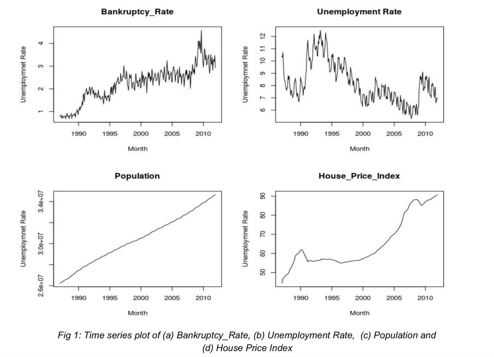
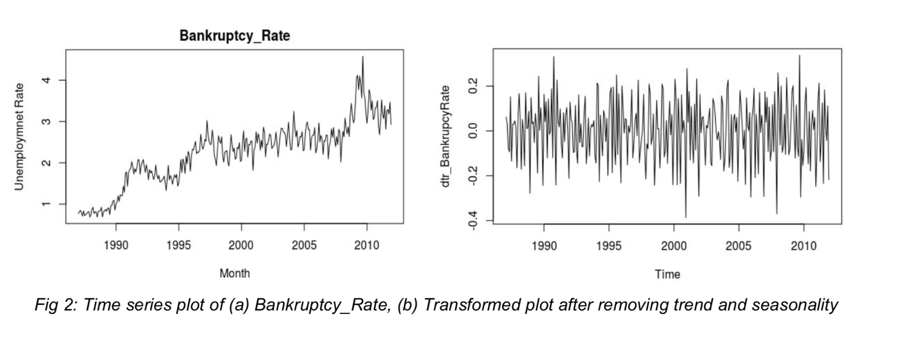
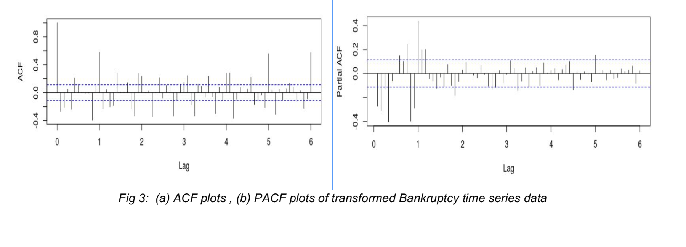
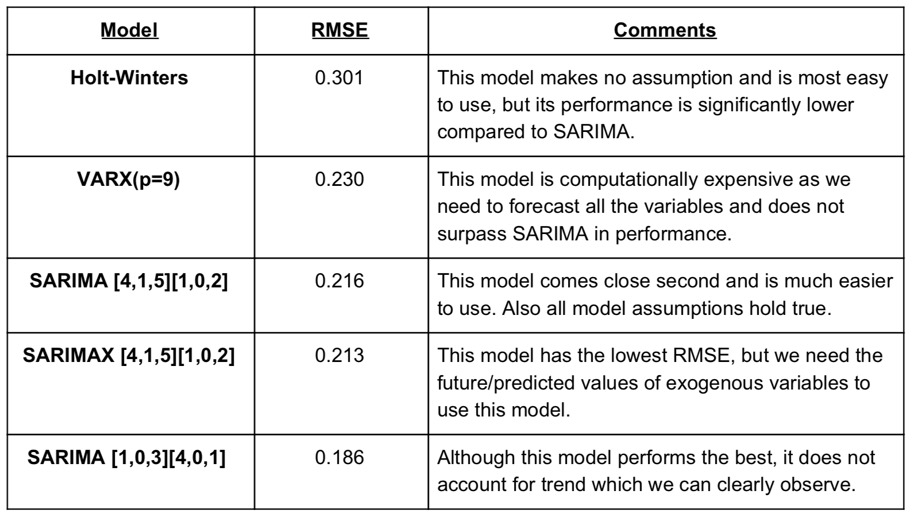
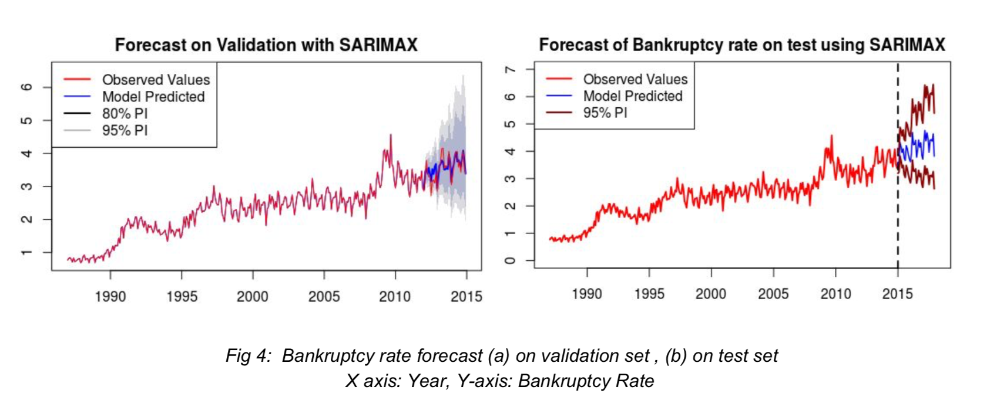

Authors: Anush Kocharyan, Quinn Keck, Jyoti Prakash, Sankeerti Haniyur

### Problem Description

&nbsp;&nbsp;&nbsp;&nbsp;&nbsp;In this project, we will try to predict the Canadian personal monthly bankruptcy rate for 2015-2017 using data on the same subject from 1987-2014. Within the dataset we used to create our model, we have bankruptcy as our variable of interest and three additional variables: unemployment rate, population, and housing price index for every month between January 1987 and December 2014. Essentially we want to create a robust model of the patterns in the data from 1987-2014 to then generalize to the future 2015-2017 timeframe. By modeling patterns in our data, we can help national banks, insurance companies, credit-lenders, etc. know what to expect in the coming months. The figure below shows graphs of the bankruptcy rate, unemployment rate, population, and house price index over time between 1987-2014.
    

  
Our data is considered “time series” data because the values are dependent on time. In other words, the time or date at which a value occurred makes a difference in that value.    
Important terms to know that will be used throughout this report:  
&nbsp;&nbsp;&nbsp;&nbsp;&nbsp;➢ Trend - the smoothed general “shape” of the data that outlines the longer-term consistent increases & decreases.  
&nbsp;&nbsp;&nbsp;&nbsp;&nbsp;&nbsp;&nbsp;&nbsp;&nbsp;&nbsp;○ Ex: In Fig 1(a) we can observe a general upward movement  
&nbsp;&nbsp;&nbsp;&nbsp;&nbsp;➢ Seasonality - regular and predictable fluctuations in the data that repeat indefinitely at the same interval.  
&nbsp;&nbsp;&nbsp;&nbsp;&nbsp;&nbsp;&nbsp;&nbsp;&nbsp;&nbsp;○ Ex: In Fig 1(b) we can observe consistent fluctuation across the time series  
&nbsp;&nbsp;&nbsp;&nbsp;&nbsp;➢ Period (m) - the interval of seasonality  
&nbsp;&nbsp;&nbsp;&nbsp;&nbsp;&nbsp;&nbsp;&nbsp;&nbsp;&nbsp;○ Ex: period is 12 for monthly data i.e m=12  
&nbsp;&nbsp;&nbsp;&nbsp;&nbsp;➢ Stationarity - the mean and variance of the time series data is consistent over time  
&nbsp;&nbsp;&nbsp;&nbsp;&nbsp;&nbsp;&nbsp;&nbsp;&nbsp;&nbsp;○ Want to account for and remove trend and seasonality from the time series data  
&nbsp;&nbsp;&nbsp;&nbsp;&nbsp;➢ RMSE- model evaluation metric that indicates how close the observed data points are to the model’s predicted values  
&nbsp;&nbsp;&nbsp;&nbsp;&nbsp;&nbsp;&nbsp;&nbsp;&nbsp;&nbsp;○ Smaller RMSE values indicate a better fit   

## Modeling Approaches

&nbsp;&nbsp;&nbsp;&nbsp;&nbsp;Our first step in the modeling process was to split the dataset into training and validation sets. We chose to build our models with the data from 1987-2011 and then test it on the data from 2012-2014. Splitting the data into train and validation set is a very important step in forecasting because it helps us gauge model performance and understand the generalization power of the model. We do not want models that simply memorize the training data. Also, we took the last 3 years data as validation set so that it resembles test data from 2015-2017. We decided to use RMSE as our model evaluation metric as the same will be used to evaluate our forecast on test data.  
&nbsp;&nbsp;&nbsp;&nbsp;&nbsp;There are many available methods which enable us to forecast future monthly observations. In this project, we have tried four approaches and they can be split up into following categories as outlined below.  

### 1. Univariate Models

&nbsp;&nbsp;&nbsp;&nbsp;&nbsp;Univariate models are ones in which we forecast the future series using its own history. In our case, we use only the bankruptcy rate from 1987-2014 to predict the bankruptcy rate from 2015-2017.   

#### 1.A. SARIMA (Seasonal Autoregressive Integrated Moving Average)  
&nbsp;&nbsp;&nbsp;&nbsp;&nbsp;SARIMA models are very useful in forecasting time series which has both trend and
seasonality. The goal of this method is to transform the non-stationary data to become stationary by accounting for trend and seasonality. In Fig 2(a), we clearly saw that our time series has both trend (upward movement of series) and hints seasonality (periodic fluctuations). We also saw that the variance (spread) of the series is not constant. To fit a SARIMA model, we first transformed our data by applying a Box-Cox transformation, which stabilizes the variance in the series and afterwards removed the trend by differencing. In other words, we took the difference between consecutive points in the time series to get a stationary series as shown in Fig 2(b). Although the time series plot hints at seasonality, running a statistical test precluded the requirement of seasonal differencing.  

After stabilizing the time series, we found the model parameters p, q, P and Q by observing and the ACF (autocorrelation function) and PACF (partial autocorrelation function) plots and tried various combinations. Here is a brief explanation of what each parameters represent:  

i) p - dependence of current response variable( yt ) on past response variables ( yt−1, yt−2 ...yt−p)  
ii) q - dependence of current response variable( yt ) on past error terms ( εt−1, εt-2 ...εt-q ) 
iii) P - Similar to p but we consider the dependence on seasonal level, i.e yt vs ( ym, y2m ...ykm )  
iv) Q - Similar to q but we consider the dependence on seasonal level, i.e yt vs ( εm,  ε2m ... εkm ) 

We used ACF plots to find q and Q and PACF plots to find p and P by noting significant spikes on the plot at normal and seasonal lags (spikes before lag 1 for p,q and spikes on 1,2,3... for P and Q).

Using the plot above, we came up with multiple parameter combinations and found p=4, P=1, q=5, Q=2, d=1 and D=0, i.e SARIMA [4,1,5][1,0,2][12], as the best performing model with RMSE 0.216.    

#### 1.B. Exponential Smoothing
&nbsp;&nbsp;&nbsp;&nbsp;&nbsp;Exponential Smoothing, or the Holt-Winters Methodology, uses the observed history of an observation up to time point n. It recursively calculates weighted averages of previous observations to then predict the next value in time. There are different smoothing equations to fit data depending on whether or not the time series has trend, seasonality and/or constant variance. We chose the multiplicative triple exponential smoothing equation which is appropriate for time series with non-constant variance that exhibits both trend and seasonality. The RMSE associated with this model was 0.301.

### 2. Multivariate Models

&nbsp;&nbsp;&nbsp;&nbsp;&nbsp;Multivariate models include multiple variables that have been collected for the same duration and frequency as the response series. This external information may help us fit more accurate models. In our case, the unemployment rate, population, and housing price index would be considered external variables and used alongside bankruptcy rate to predict the response series. 

Important distinction when referring to external variables:  
&nbsp;&nbsp;&nbsp;&nbsp;&nbsp;➢ Exogenous variables - variables that influence the response, but not the other way around (one-way relationship)  
&nbsp;&nbsp;&nbsp;&nbsp;&nbsp;➢ Endogenous variables - variables that influence the response and vice versa (two-way relationship)    

#### 2.A. SARIMAX

&nbsp;&nbsp;&nbsp;&nbsp;&nbsp;A SARIMAX model is appropriate to use if we treat the external variables as exogenous. It is an extension of the univariate SARIMA model described above, but with the added external variables of unemployment rate and population. To find the best SARIMAX model, we transformed our data in exactly the same way as we did when fitting a SARIMA model. We then recursively tried variable combinations to optimize for RMSE and found SARIMA [4,1,5][1,0,2][12] with population and unemployment rate as exogenous variables as the best model with the lowest RMSE of 0.213.   

#### 2.B. VARX

&nbsp;&nbsp;&nbsp;&nbsp;&nbsp;If we treat some of the external variables as endogenous, then VARX models are more effective in explaining the bi-directional relationships between the variables. We explored VAR models with different combinations of exogenous variables and endogenous variables. We found the best model had population as an exogenous variable and unemployment rate, bankruptcy rate, and housing price index as endogenous variables. Intuitively, it makes sense that population might not be influenced by the bankruptcy rate. With a more over-fit model that used the 27 previous observations to predict the response, the RMSE could be lowered 0.2296392, but we were concerned this could lead to overfitting the data. If we only looked back at 9 observations (p=9) the RMSE was 0.2846927.   

### Model Comparison & Results

&nbsp;&nbsp;&nbsp;&nbsp;&nbsp;In the table below, we compared our best performing model from each different approach using the RMSE for forecasting on the 2012-2014 data. They are ordered from largest to smallest RMSE. We based our model selection on lowest RMSE and compared various models based on their merit and ease of use for forecasting:

 
  
From above table, we safely concluded that SARIMA[4,1,5][1,0,2][12] is the most effective model both in terms of performance and ease of use. We would recommend using this model for future forecasts. Note that SARIMAX performs slightly better and could be used for prediction for this project as we have the future data of exogenous variables given, but in more practical scenarios, SARIMA is much easier to use.

Figure 4 above shows how our model performed on the validation set and the test set. Since we have the actual values for the validation set, we can see that the model predicted the bankruptcy values quite accurately. For this project, we chose SARIMAX[4,1,5][1,0,2][12] with population and unemployment rate as exogeneous variables to submit our forecasts owing to slightly better performance.

